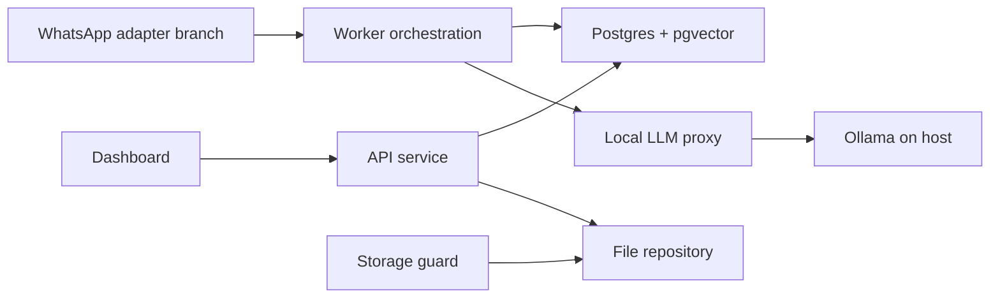

<h1 align="center">Pratiksha - WhatsApp AI Companion</h1>
<p align="center">Local-first WhatsApp AI companion with Docker, Postgres memory, resource matching, local LLMs, and a visual control room.</p>
<p align="center">
  <a href="#what-it-does">Features</a> |
  <a href="#run-and-stop">Run and stop</a> |
  <a href="#storage-and-docker">Storage</a> |
  <a href="#architecture">Architecture</a> |
  <a href="#creators">Creators</a>
</p>
<p align="center">
  
  
  
  
  
</p>

Pratiksha is a local-first WhatsApp companion designed for private, SSD-backed automation. It keeps the durable system of record in Postgres, uses local LLMs through Ollama, indexes a file repository for resource suggestions, and gives the owner a polished dashboard for control, logs, and operational visibility.


## What It Does

- Runs as Docker services with a visual dashboard, API, Postgres, local LLM proxy, and storage guard.
- Keeps canonical chats, drafts, resources, policy state, logs, and audit records in Postgres.
- Indexes a local file repository so the assistant can suggest likely files instead of requiring exact filenames.
- Blocks file sends until the trusted WhatsApp recipient confirms from WhatsApp.
- Shows categorized logs plus raw container logs from the dashboard.
- Supports dark mode, mobile views, upload controls, storage status, and health checks.
- Keeps public defaults portable while allowing a private `.env` to place heavy runtime data on an external SSD.

## How It Was Made

- TypeScript monorepo with shared packages for config, policy, AI, resources, database access, logging, metrics, and WhatsApp adapter contracts.
- Docker Compose owns the runtime lifecycle, so start and stop are single-command operations.
- Postgres plus pgvector is the canonical state store for messages, resources, drafts, jobs, policy, health, and audit events.
- Ollama stays behind an internal LLM proxy so model settings, timeouts, and response parsing are centralized.
- The dashboard is intentionally plain-language first: owner controls are separated from logs, and file-send confirmation remains recipient-side.

## Screenshots

| Assistant Controls | File Repository |
| --- | --- |
|  |  |

| Raw Logs | Mobile |
| --- | --- |
|  |  |

## Run And Stop

From the repository root, start the full live stack after `.env` is configured:

```bash
corepack pnpm stack:live:up
```

Stop everything:

```bash
corepack pnpm stack:down
```

That live command first stops stale Compose services, runs a WhatsApp store preflight, then starts the dashboard, API, Postgres, LLM proxy, storage guard, and live worker. The preflight preserves `session.db`, backs up any malformed disposable `wacli.db` cache into the configured backup folder, and warms a missing or empty cache with a bounded `wacli sync --once` before the worker starts.

Dashboard-only safe mode:

```bash
corepack pnpm stack:dashboard:up
```

Dashboard: [http://localhost:8788](http://localhost:8788)
API: [http://localhost:8787](http://localhost:8787)
LLM proxy: [http://localhost:8791](http://localhost:8791)

## First Setup

```bash
cp .env.example .env
corepack pnpm install --frozen-lockfile
corepack pnpm bootstrap:data
corepack pnpm stack:dashboard:up
```

Use `.env` to choose the host data directory, resource folder, API token, Postgres password, and Ollama model. The default compose file stores runtime data under `./.pratiksha-data` and shareable files under `./viji-files`; both are ignored by git.

## Storage And Docker

Pratiksha separates project runtime data from Docker Desktop's global image storage.

Project runtime data is controlled by `.env`:

```env
PRATIKSHA_HOST_DATA_ROOT=./.pratiksha-data
PRATIKSHA_HOST_RESOURCE_ROOT=./viji-files
VIJI_CONTAINER_DATA_ROOT=/data/pratiksha
VIJI_CONTAINER_RESOURCE_ROOT=/data/pratiksha/viji-files
```

For an external SSD setup, change only the host paths in your private `.env`.
Do not commit those machine-specific paths. Docker Desktop image/VM storage is a
separate global Docker Desktop setting; moving it to an SSD can affect other
Docker projects too, while Pratiksha's Compose mounts affect only this project.

## File Repository

Shareable files live under `PRATIKSHA_HOST_RESOURCE_ROOT`, mounted into the
containers as `VIJI_CONTAINER_RESOURCE_ROOT`. Files must be registered before
Pratiksha can suggest or send them. A file send is queued only after the
WhatsApp requester confirms the exact pending proposal from WhatsApp.

Received WhatsApp media is treated as adapter/media input first. Reusing it as a
shareable resource requires the same catalog and confirmation path as local
files.

## Local AI

Pratiksha talks to Ollama through the `llm-proxy` service. The default model target is:

```text
qwen3:4b-instruct-2507-q4_K_M
```

The model is expected to run on the host at `http://host.docker.internal:11434`. You can change this in `.env` with `VIJI_OLLAMA_DOCKER_BASE_URL` and `VIJI_OLLAMA_MODEL`.

## Architecture



The public main branch contains the dashboard, API, worker logic, resource matching, Postgres schema, local LLM proxy, and storage guard. Live WhatsApp adapter tooling is intentionally staged separately so it can be reviewed and merged with stricter operational checks.

See [Live WhatsApp Adapter](docs/LIVE_WHATSAPP_ADAPTER.md) for the adapter branch runtime and guardrails.

## Safety Model

- No `.env`, runtime data, adapter auth stores, database files, logs, model blobs, or uploaded files should be committed.
- File sends require recipient-side WhatsApp confirmation; owner dashboard approval is not treated as authority.
- Postgres is the canonical state store. Adapter cache files are operational inputs only.
- WhatsApp auth state is preserved across restarts. Disposable adapter cache corruption is handled before startup instead of requiring manual cleanup.
- Storage usage is tracked against the configured Pratiksha data root, with filesystem free space treated as a separate safety signal.

## Monitoring And Logs

The dashboard is the primary visual control room. It surfaces runtime status,
storage health, conversations, pending resource confirmations, resource catalog
state, audit events, categorized logs, and raw container logs. CLI commands are
kept as a fallback for headless operation and debugging.

Observability data should stay under the configured runtime data root. Logs,
metrics, and dashboards are useful operator artifacts, not source files.

## Repository Map

```text
apps/dashboard       Visual control room and upload UI
apps/api             HTTP API, dashboard data, resource endpoints
apps/worker          Draft, resource, policy, and outbound orchestration
apps/wa-adapter-wacli Live personal WhatsApp adapter boundary
apps/llm-proxy       Local Ollama proxy
apps/storage-guard   Storage root and quota checks
tools/wacli-mark-read Adapter-owned read-receipt helper
packages/*           Shared TypeScript libraries
migrations           Postgres schema and seed data
docs                 ERD and screenshots
```

## Publishing Safety

See [docs/PUBLISHING.md](docs/PUBLISHING.md) before opening or pushing public
branches. Public commits must not contain private absolute paths, real contact
details, auth stores, `.env`, databases, local media, logs, backups, or model
files.

## Checks

```bash
corepack pnpm typecheck
corepack pnpm test
docker compose --profile dashboard config
```

Some integration tests require Docker to be running because they spin up disposable Postgres containers.

## Sensitive/Local-Only Files

These files and directories should stay local and are ignored by git:

- `.env`
- `.pratiksha-data/`
- `viji-files/`
- local model files
- Postgres runtime data
- WhatsApp adapter auth/cache stores
- backups, logs, and generated build output

## Creators

### Vijaya Lakshmi D S
[](https://github.com/viji-saravanan)
[](https://www.linkedin.com/in/vijaya-lakshmi-saravanan-305972298/)

### Arya Subramani S
[](https://github.com/callmearya)
[](https://www.linkedin.com/in/arya-subramani/)

## Contributing

Issues and PRs are welcome. For changes touching WhatsApp live automation, file-send policy, storage behavior, or local model execution, open a PR with the checks you ran and call out any live-account behavior explicitly.
