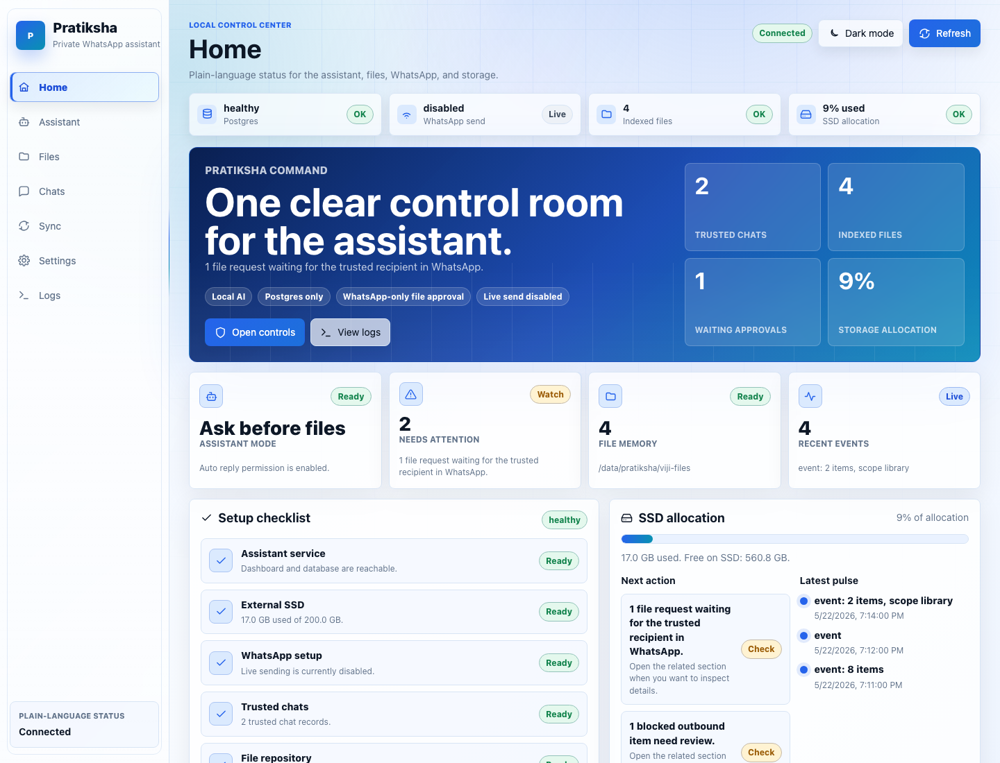
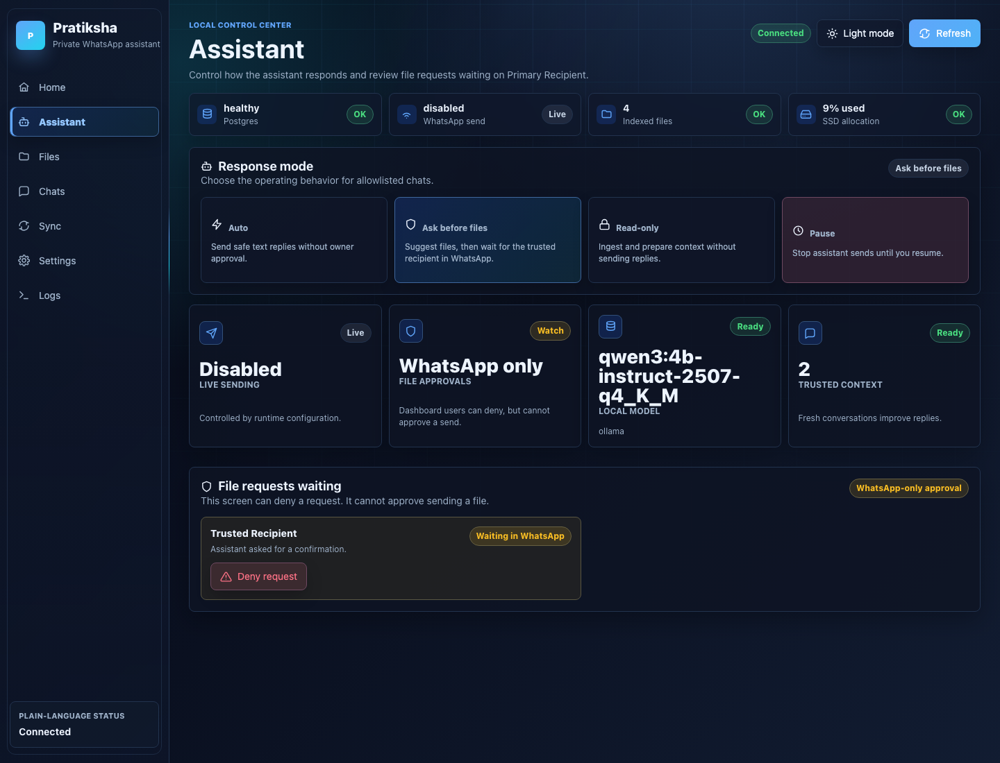
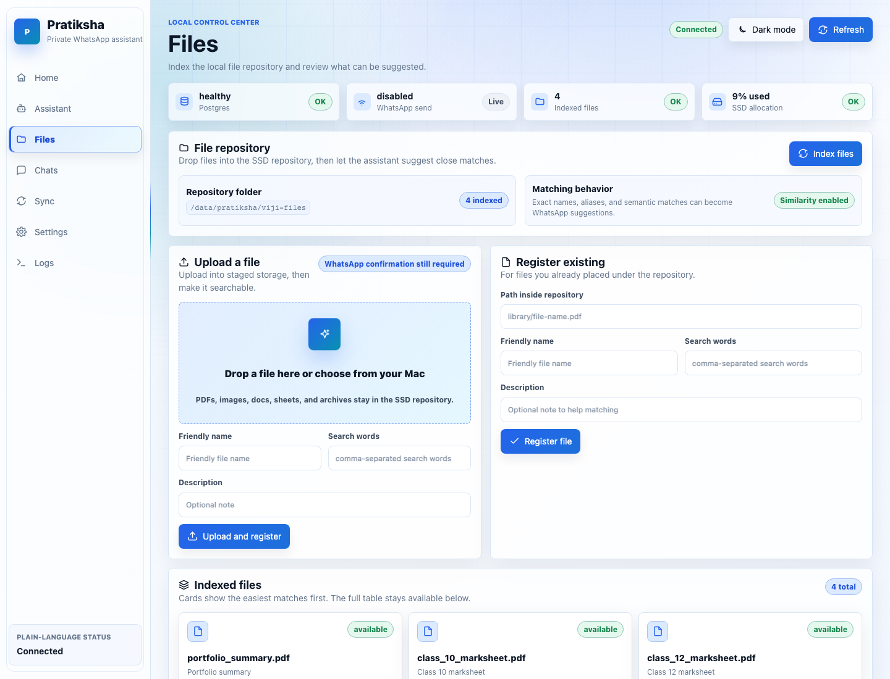
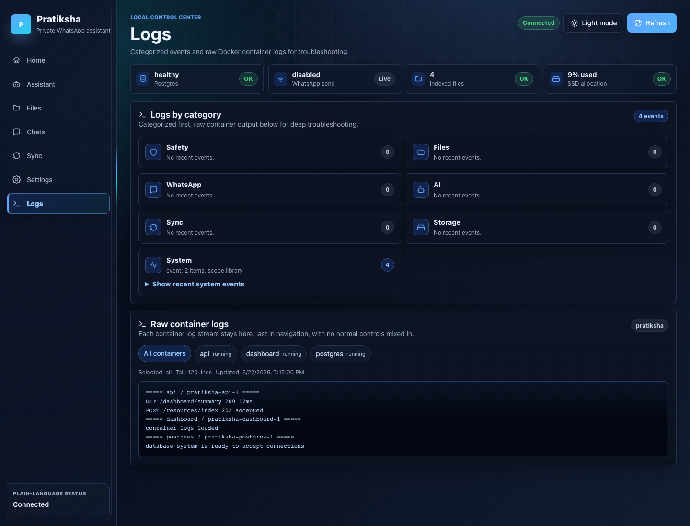
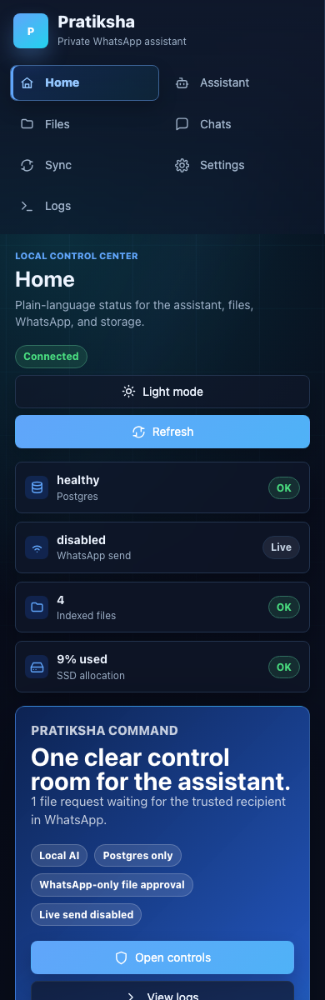
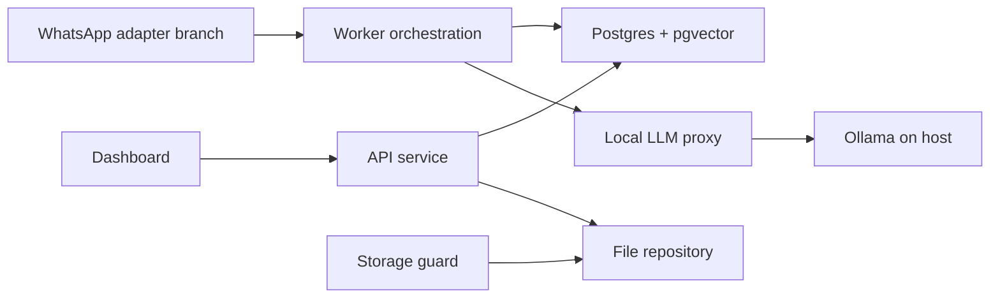

# Pratiksha - WhatsApp AI Companion

Pratiksha is a local-first WhatsApp companion designed for private, SSD-backed automation. It keeps the durable system of record in Postgres, uses local LLMs through Ollama, indexes a file repository for resource suggestions, and gives the owner a polished dashboard for control, logs, and operational visibility.



## What It Does

- Runs as Docker services with a visual dashboard, API, Postgres, local LLM proxy, and storage guard.
- Keeps canonical chats, drafts, resources, policy state, logs, and audit records in Postgres.
- Indexes a local file repository so the assistant can suggest likely files instead of requiring exact filenames.
- Blocks file sends until the trusted WhatsApp recipient confirms from WhatsApp.
- Shows categorized logs plus raw container logs from the dashboard.
- Supports dark mode, mobile views, upload controls, storage status, and health checks.

## Screenshots

| Assistant Controls | File Repository |
| --- | --- |
|  |  |

| Raw Logs | Mobile |
| --- | --- |
|  |  |

## Run And Stop

Start everything:

```bash
corepack pnpm stack:dashboard:up
```

Stop everything:

```bash
corepack pnpm stack:down
```

Dashboard: [http://localhost:8788](http://localhost:8788)
API: [http://localhost:8787](http://localhost:8787)
LLM proxy: [http://localhost:8791](http://localhost:8791)

## First Setup

```bash
cp .env.example .env
corepack pnpm install --frozen-lockfile
corepack pnpm bootstrap:data
corepack pnpm stack:dashboard:up
```

Use `.env` to choose the host data directory, resource folder, API token, Postgres password, and Ollama model. The default compose file stores runtime data under `./.pratiksha-data` and shareable files under `./viji-files`; both are ignored by git.

## Local AI

Pratiksha talks to Ollama through the `llm-proxy` service. The default model target is:

```text
qwen3:4b-instruct-2507-q4_K_M
```

The model is expected to run on the host at `http://host.docker.internal:11434`. You can change this in `.env` with `VIJI_OLLAMA_DOCKER_BASE_URL` and `VIJI_OLLAMA_MODEL`.

## Architecture



The public main branch contains the dashboard, API, worker logic, resource matching, Postgres schema, local LLM proxy, and storage guard. Live WhatsApp adapter tooling is intentionally staged separately so it can be reviewed and merged with stricter operational checks.

## Safety Model

- No `.env`, runtime data, adapter auth stores, database files, logs, model blobs, or uploaded files should be committed.
- File sends require recipient-side WhatsApp confirmation; owner dashboard approval is not treated as authority.
- Postgres is the canonical state store. Adapter cache files are operational inputs only.
- Storage usage is tracked against the configured Pratiksha data root, with filesystem free space treated as a separate safety signal.

## Repository Map

```text
apps/dashboard       Visual control room and upload UI
apps/api             HTTP API, dashboard data, resource endpoints
apps/worker          Draft, resource, policy, and outbound orchestration
apps/llm-proxy       Local Ollama proxy
apps/storage-guard   Storage root and quota checks
packages/*           Shared TypeScript libraries
migrations           Postgres schema and seed data
docs                 ERD and screenshots
```

## Checks

```bash
corepack pnpm typecheck
corepack pnpm test
docker compose --profile dashboard config
```

Some integration tests require Docker to be running because they spin up disposable Postgres containers.
