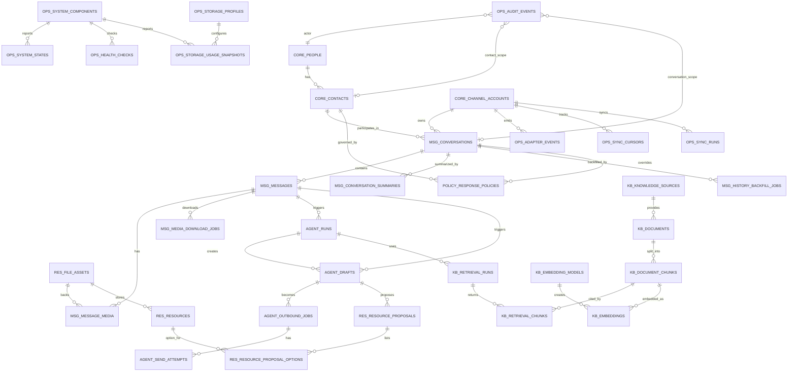

# Entity Relationship Design

## 1. Purpose

This ERD supports a local-first personal WhatsApp AI assistant that starts with policy-gated trusted-contact text replies, then adds a smart resource catalog with recipient-confirmed file sending, allowlisted chat history recovery, media sync, monitoring, auditability, and safe idle-state behavior.

The database is Postgres with pgvector. Large files, models, WhatsApp stores, media, logs, and backups live under `<external-data-root>`. The default storage allocation is `large-200gb`.

## 2. Naming Policy

All physical table names use a domain prefix. All physical column names use a singular table-stem prefix.

Examples:

- `core_people.core_person_id`
- `core_people.core_person_display_name`
- `msg_messages.msg_message_body`
- `agent_drafts.agent_draft_created_at`
- `ops_sync_runs.ops_sync_run_started_at`

Foreign keys use a semantic role plus the referenced target key name:

- `sender_core_contact_id`
- `trigger_msg_message_id`
- `reply_to_msg_message_id`
- `recipient_core_contact_id`
- `storage_profile_ops_storage_profile_id`

Generated migrations must not create generic physical columns such as `id`, `name`, `state`, `created_at`, or `updated_at`.

## 3. Table Prefix Policy

| Prefix | Domain | Tables |
| --- | --- | --- |
| `core_` | Identity and connected accounts | `core_people`, `core_contacts`, `core_channel_accounts` |
| `msg_` | Conversations, messages, summaries, media, and backfill | `msg_conversations`, `msg_messages`, `msg_message_media`, `msg_conversation_summaries`, `msg_history_backfill_jobs`, `msg_media_download_jobs` |
| `agent_` | AI runs, drafts, outbox, send attempts | `agent_runs`, `agent_drafts`, `agent_outbound_jobs`, `agent_send_attempts` |
| `kb_` | Resource-catalog search and document retrieval | `kb_knowledge_sources`, `kb_documents`, `kb_document_chunks`, `kb_embedding_models`, `kb_embeddings`, `kb_retrieval_runs`, `kb_retrieval_chunks` |
| `res_` | Files and shareable resources | `res_file_assets`, `res_resources`, `res_resource_proposals`, `res_resource_proposal_options` |
| `policy_` | Reply and sharing policy | `policy_response_policies` |
| `ops_` | Adapter events, sync cursors/runs, health, audit, storage quota | `ops_adapter_events`, `ops_sync_cursors`, `ops_sync_runs`, `ops_system_components`, `ops_system_states`, `ops_health_checks`, `ops_audit_events`, `ops_storage_profiles`, `ops_storage_usage_snapshots` |

## 4. High-Level ERD



## 5. Core Entities

### `core_people`

| Field | Type | Notes |
| --- | --- | --- |
| `core_person_id` | uuid pk | Internal person identity |
| `core_person_display_name` | text | Example: Vijayalakshmi Saravanan |
| `core_person_notes` | text nullable | Optional private notes |
| `core_person_created_at` | timestamptz |  |
| `core_person_updated_at` | timestamptz |  |

### `core_contacts`

| Field | Type | Notes |
| --- | --- | --- |
| `core_contact_id` | uuid pk |  |
| `owner_core_person_id` | uuid fk | `core_people.core_person_id` |
| `core_contact_channel` | text | `whatsapp_personal`, future `whatsapp_business` |
| `core_contact_display_name` | text | Name as seen in WhatsApp |
| `core_contact_phone_e164` | text nullable | Normalized phone if known |
| `core_contact_wa_jid` | text nullable unique | WhatsApp JID if known |
| `core_contact_is_allowlisted` | boolean | Must be true for processing |
| `core_contact_trust_level` | text | `low`, `normal`, `trusted` |
| `core_contact_created_at` | timestamptz |  |
| `core_contact_updated_at` | timestamptz |  |

Indexes:

- Unique partial index on `core_contact_wa_jid where core_contact_wa_jid is not null`.
- Index on `owner_core_person_id`.
- Index on `(core_contact_channel, core_contact_is_allowlisted)`.

### `core_channel_accounts`

| Field | Type | Notes |
| --- | --- | --- |
| `core_channel_account_id` | uuid pk | Connected account/session |
| `core_channel_account_channel` | text | `whatsapp_personal` |
| `core_channel_account_adapter_type` | text | `wacli`, `whatsmeow`, `baileys`, `wwebjs`, `official_cloud` |
| `core_channel_account_label` | text | Human-readable label |
| `core_channel_account_store_path` | text | External-drive adapter store path |
| `core_channel_account_state` | text | `ready`, `auth_required`, `backoff`, `readonly`, `disabled` |
| `core_channel_account_last_healthy_at` | timestamptz nullable |  |
| `core_channel_account_created_at` | timestamptz |  |
| `core_channel_account_updated_at` | timestamptz |  |

## 6. Message and Context Entities

### `msg_conversations`

| Field | Type | Notes |
| --- | --- | --- |
| `msg_conversation_id` | uuid pk | Chat thread |
| `owner_core_channel_account_id` | uuid fk | `core_channel_accounts.core_channel_account_id` |
| `primary_core_contact_id` | uuid fk nullable | Primary DM contact; `core_contacts.core_contact_id` |
| `msg_conversation_external_chat_id` | text | WhatsApp JID or adapter chat ID |
| `msg_conversation_type` | text | `dm`, `group` |
| `msg_conversation_title` | text | Chat title |
| `msg_conversation_state` | text | `active`, `paused`, `archived`, `ignored` |
| `msg_conversation_context_state` | text | `fresh`, `stale`, `recovering`, `unknown` |
| `msg_conversation_last_message_at` | timestamptz nullable |  |
| `msg_conversation_last_synced_at` | timestamptz nullable | Last successful sync checkpoint |
| `msg_conversation_created_at` | timestamptz |  |
| `msg_conversation_updated_at` | timestamptz |  |

Indexes:

- Unique index on `(owner_core_channel_account_id, msg_conversation_external_chat_id)`.
- Index on `(primary_core_contact_id, msg_conversation_state)`.
- Index on `(msg_conversation_context_state, msg_conversation_last_synced_at)`.

### `msg_messages`

| Field | Type | Notes |
| --- | --- | --- |
| `msg_message_id` | uuid pk |  |
| `parent_msg_conversation_id` | uuid fk | `msg_conversations.msg_conversation_id` |
| `sender_core_contact_id` | uuid fk nullable | Null for self/system; `core_contacts.core_contact_id` |
| `reply_to_msg_message_id` | uuid fk nullable | `msg_messages.msg_message_id` |
| `adapter_ops_adapter_event_id` | uuid fk nullable | `ops_adapter_events.ops_adapter_event_id` |
| `msg_message_external_message_id` | text | WhatsApp message ID |
| `msg_message_direction` | text | `inbound`, `outbound` |
| `msg_message_type` | text | `text`, `image`, `video`, `audio`, `document`, `system` |
| `msg_message_body` | text nullable | Text body if retained |
| `msg_message_body_redacted` | boolean | True if full body removed |
| `msg_message_adapter_metadata` | jsonb | Safe adapter metadata such as quoted WhatsApp IDs |
| `msg_message_status` | text | `received`, `drafted`, `queued`, `sent`, `failed`, `ignored` |
| `msg_message_sent_at` | timestamptz nullable |  |
| `msg_message_received_at` | timestamptz nullable |  |
| `msg_message_created_at` | timestamptz |  |

Constraints:

- Unique index on `(parent_msg_conversation_id, msg_message_external_message_id)`.
- Check `msg_message_direction in ('inbound','outbound')`.

### `msg_message_media`

Media attached to normalized WhatsApp messages. For allowlisted received media, downloaded files should be linked to `res_file_assets`; media that Vijayalakshmi may request again can later be promoted into `res_resources` without duplicating file bytes.

| Field | Type | Notes |
| --- | --- | --- |
| `msg_message_media_id` | uuid pk |  |
| `parent_msg_message_id` | uuid fk | `msg_messages.msg_message_id` |
| `backing_res_file_asset_id` | uuid fk nullable | `res_file_assets.res_file_asset_id` |
| `msg_message_media_external_media_id` | text nullable | WhatsApp/adapter media ID |
| `msg_message_media_mime_type` | text |  |
| `msg_message_media_file_name` | text nullable |  |
| `msg_message_media_size_bytes` | bigint nullable |  |
| `msg_message_media_download_state` | text | `not_requested`, `queued`, `downloaded`, `failed`, `blocked` |
| `msg_message_media_created_at` | timestamptz |  |

### `msg_conversation_summaries`

Rolling summaries keep prompt context compact after full-history backfill.

| Field | Type | Notes |
| --- | --- | --- |
| `msg_conversation_summary_id` | uuid pk |  |
| `parent_msg_conversation_id` | uuid fk | `msg_conversations.msg_conversation_id` |
| `from_msg_message_id` | uuid fk nullable | First message covered; `msg_messages.msg_message_id` |
| `to_msg_message_id` | uuid fk nullable | Last message covered; `msg_messages.msg_message_id` |
| `msg_conversation_summary_kind` | text | `rolling`, `daily`, `manual`, `backfill` |
| `msg_conversation_summary_text` | text | Compact context summary |
| `msg_conversation_summary_token_count` | integer nullable |  |
| `msg_conversation_summary_created_at` | timestamptz |  |
| `msg_conversation_summary_updated_at` | timestamptz |  |

Indexes:

- Index on `(parent_msg_conversation_id, msg_conversation_summary_kind)`.
- Index on `(parent_msg_conversation_id, to_msg_message_id)`.

### `msg_history_backfill_jobs`

Resumable jobs for retrieving all available allowlisted history.

| Field | Type | Notes |
| --- | --- | --- |
| `msg_history_backfill_job_id` | uuid pk |  |
| `target_msg_conversation_id` | uuid fk | `msg_conversations.msg_conversation_id` |
| `msg_history_backfill_job_state` | text | `queued`, `running`, `paused`, `completed`, `failed`, `blocked` |
| `msg_history_backfill_job_cursor` | text nullable | Adapter-specific backfill cursor |
| `oldest_seen_msg_message_id` | uuid fk nullable | `msg_messages.msg_message_id` |
| `msg_history_backfill_job_messages_imported` | integer |  |
| `msg_history_backfill_job_error_code` | text nullable |  |
| `msg_history_backfill_job_error_message` | text nullable | Redacted |
| `msg_history_backfill_job_started_at` | timestamptz nullable |  |
| `msg_history_backfill_job_finished_at` | timestamptz nullable |  |
| `msg_history_backfill_job_created_at` | timestamptz |  |
| `msg_history_backfill_job_updated_at` | timestamptz |  |

Indexes:

- Index on `(target_msg_conversation_id, msg_history_backfill_job_state)`.

### `msg_media_download_jobs`

Quota-controlled media downloads for allowlisted chats.

| Field | Type | Notes |
| --- | --- | --- |
| `msg_media_download_job_id` | uuid pk |  |
| `target_msg_message_media_id` | uuid fk | `msg_message_media.msg_message_media_id` |
| `target_msg_conversation_id` | uuid fk | `msg_conversations.msg_conversation_id` |
| `msg_media_download_job_state` | text | `queued`, `running`, `downloaded`, `failed`, `blocked`, `skipped` |
| `msg_media_download_job_priority` | integer | Lower is earlier |
| `msg_media_download_job_blocked_reason` | text nullable | Storage or policy reason |
| `msg_media_download_job_error_code` | text nullable |  |
| `msg_media_download_job_error_message` | text nullable | Redacted |
| `msg_media_download_job_created_at` | timestamptz |  |
| `msg_media_download_job_updated_at` | timestamptz |  |

Indexes:

- Index on `(target_msg_conversation_id, msg_media_download_job_state)`.
- Unique index on `target_msg_message_media_id`.

## 7. Agent and Outbox Entities

### `agent_runs`

| Field | Type | Notes |
| --- | --- | --- |
| `agent_run_id` | uuid pk |  |
| `parent_msg_conversation_id` | uuid fk | `msg_conversations.msg_conversation_id` |
| `trigger_msg_message_id` | uuid fk | Inbound `msg_messages.msg_message_id` |
| `agent_run_state` | text | `started`, `drafted`, `blocked`, `failed` |
| `agent_run_model_name` | text | Local model identifier |
| `agent_run_prompt_hash` | text | Hash, not necessarily full prompt |
| `agent_run_context_state` | text | `fresh`, `stale`, `partial` |
| `agent_run_latency_ms` | integer nullable |  |
| `agent_run_input_tokens` | integer nullable |  |
| `agent_run_output_tokens` | integer nullable |  |
| `agent_run_error_code` | text nullable |  |
| `agent_run_error_message` | text nullable | Redacted |
| `agent_run_created_at` | timestamptz |  |
| `agent_run_finished_at` | timestamptz nullable |  |

### `agent_drafts`

| Field | Type | Notes |
| --- | --- | --- |
| `agent_draft_id` | uuid pk |  |
| `parent_msg_conversation_id` | uuid fk | `msg_conversations.msg_conversation_id` |
| `trigger_msg_message_id` | uuid fk | `msg_messages.msg_message_id` |
| `source_agent_run_id` | uuid fk | `agent_runs.agent_run_id` |
| `agent_draft_body` | text | Proposed reply, including `[Pratiksha]` prefix when destined for send |
| `agent_draft_confidence` | numeric nullable | Optional model/policy score |
| `agent_draft_policy_state` | text | `candidate`, `auto_allowed`, `confirm_resource`, `blocked`, `sent`, `expired` |
| `agent_draft_decided_at` | timestamptz nullable | Policy decision timestamp |
| `agent_draft_created_at` | timestamptz |  |

### `agent_outbound_jobs`

| Field | Type | Notes |
| --- | --- | --- |
| `agent_outbound_job_id` | uuid pk |  |
| `target_msg_conversation_id` | uuid fk | `msg_conversations.msg_conversation_id` |
| `source_agent_draft_id` | uuid fk nullable | `agent_drafts.agent_draft_id` |
| `agent_outbound_job_kind` | text | `text_reply`, `resource_send` |
| `agent_outbound_job_payload` | jsonb | Dispatch payload; audit events must not duplicate full text bodies |
| `agent_outbound_job_state` | text | `queued`, `sending`, `sent`, `failed`, `cancelled`, `blocked` |
| `agent_outbound_job_priority` | integer | Lower is earlier |
| `agent_outbound_job_scheduled_at` | timestamptz |  |
| `agent_outbound_job_idempotency_key` | text unique | Prevent duplicate sends |
| `agent_outbound_job_blocked_reason` | text nullable | Idle/policy reason |
| `agent_outbound_job_created_at` | timestamptz |  |
| `agent_outbound_job_updated_at` | timestamptz |  |

### `agent_send_attempts`

| Field | Type | Notes |
| --- | --- | --- |
| `agent_send_attempt_id` | uuid pk |  |
| `target_agent_outbound_job_id` | uuid fk | `agent_outbound_jobs.agent_outbound_job_id` |
| `agent_send_attempt_adapter_type` | text |  |
| `agent_send_attempt_number` | integer |  |
| `agent_send_attempt_state` | text | `started`, `succeeded`, `failed` |
| `agent_send_attempt_external_message_id` | text nullable | Returned by adapter |
| `agent_send_attempt_error_code` | text nullable |  |
| `agent_send_attempt_error_message` | text nullable | Redacted |
| `agent_send_attempt_started_at` | timestamptz |  |
| `agent_send_attempt_finished_at` | timestamptz nullable |  |

## 8. Resource Catalog and Retrieval Entities

### `kb_knowledge_sources`

| Field | Type | Notes |
| --- | --- | --- |
| `kb_knowledge_source_id` | uuid pk |  |
| `kb_knowledge_source_type` | text | `local_folder`, `local_file`, `resource_file_asset`, `drive`, `url`, `manual` |
| `kb_knowledge_source_name` | text |  |
| `kb_knowledge_source_uri` | text | External-drive path or connector URI |
| `kb_knowledge_source_sync_state` | text | `pending`, `syncing`, `indexed`, `failed`, `disabled` |
| `kb_knowledge_source_last_sync_at` | timestamptz nullable |  |
| `kb_knowledge_source_created_at` | timestamptz |  |
| `kb_knowledge_source_updated_at` | timestamptz |  |

### `kb_documents`

| Field | Type | Notes |
| --- | --- | --- |
| `kb_document_id` | uuid pk |  |
| `source_kb_knowledge_source_id` | uuid fk | `kb_knowledge_sources.kb_knowledge_source_id` |
| `original_res_file_asset_id` | uuid fk nullable | `res_file_assets.res_file_asset_id` |
| `kb_document_title` | text |  |
| `kb_document_mime_type` | text |  |
| `kb_document_content_hash` | text |  |
| `kb_document_version_label` | text nullable |  |
| `kb_document_indexed_state` | text | `pending`, `extracting`, `chunked`, `embedded`, `failed`, `unsupported` |
| `kb_document_extraction_status` | text | `pending`, `extracted`, `unsupported`, `failed` |
| `kb_document_extraction_error` | text nullable | Bounded error code such as `invalid_pdf_header` |
| `kb_document_extractor_name` | text nullable | Local extractor identifier |
| `kb_document_extractor_version` | text nullable | Extractor implementation version |
| `kb_document_extractor_metadata` | jsonb | Flexible extractor metadata such as parser name and tool status |
| `kb_document_created_at` | timestamptz |  |
| `kb_document_updated_at` | timestamptz |  |

Constraints:

- Unique index on `(source_kb_knowledge_source_id, kb_document_content_hash)`.
- Unique partial index on `original_res_file_asset_id` when present.

### `kb_document_chunks`

| Field | Type | Notes |
| --- | --- | --- |
| `kb_document_chunk_id` | uuid pk |  |
| `parent_kb_document_id` | uuid fk | `kb_documents.kb_document_id` |
| `kb_document_chunk_index` | integer |  |
| `kb_document_chunk_content` | text | Extracted text |
| `kb_document_chunk_token_count` | integer nullable |  |
| `kb_document_chunk_page_start` | integer nullable |  |
| `kb_document_chunk_page_end` | integer nullable |  |
| `kb_document_chunk_metadata` | jsonb | Section headings, tags, page hints, and `untrustedExtractedContent` marker |
| `kb_document_chunk_created_at` | timestamptz |  |

### `kb_embedding_models`

| Field | Type | Notes |
| --- | --- | --- |
| `kb_embedding_model_id` | uuid pk |  |
| `kb_embedding_model_name` | text unique |  |
| `kb_embedding_model_dimensions` | integer |  |
| `kb_embedding_model_runtime` | text | `local` |
| `kb_embedding_model_created_at` | timestamptz |  |

### `kb_embeddings`

| Field | Type | Notes |
| --- | --- | --- |
| `kb_embedding_id` | uuid pk |  |
| `target_kb_document_chunk_id` | uuid fk | `kb_document_chunks.kb_document_chunk_id` |
| `model_kb_embedding_model_id` | uuid fk | `kb_embedding_models.kb_embedding_model_id` |
| `kb_embedding_vector` | vector | pgvector column |
| `kb_embedding_created_at` | timestamptz |  |

Constraints:

- Unique index on `(target_kb_document_chunk_id, model_kb_embedding_model_id)`.

### `kb_retrieval_runs`

| Field | Type | Notes |
| --- | --- | --- |
| `kb_retrieval_run_id` | uuid pk |  |
| `source_agent_run_id` | uuid fk | `agent_runs.agent_run_id` |
| `model_kb_embedding_model_id` | uuid fk | `kb_embedding_models.kb_embedding_model_id` |
| `kb_retrieval_run_query_text` | text | May be redacted later |
| `kb_retrieval_run_top_k` | integer |  |
| `kb_retrieval_run_latency_ms` | integer nullable |  |
| `kb_retrieval_run_created_at` | timestamptz |  |

### `kb_retrieval_chunks`

| Field | Type | Notes |
| --- | --- | --- |
| `kb_retrieval_chunk_id` | uuid pk |  |
| `parent_kb_retrieval_run_id` | uuid fk | `kb_retrieval_runs.kb_retrieval_run_id` |
| `target_kb_document_chunk_id` | uuid fk | `kb_document_chunks.kb_document_chunk_id` |
| `kb_retrieval_chunk_rank` | integer |  |
| `kb_retrieval_chunk_score` | numeric |  |
| `kb_retrieval_chunk_included_in_prompt` | boolean |  |

## 9. File and Resource Entities

### `res_file_assets`

Canonical file metadata for both manually registered shareable files and downloaded allowlisted WhatsApp media. A file asset is not automatically shareable until it is represented by an allowed `res_resources` row and passes recipient confirmation policy.

| Field | Type | Notes |
| --- | --- | --- |
| `res_file_asset_id` | uuid pk |  |
| `res_file_asset_storage_uri` | text | External-drive path |
| `res_file_asset_original_uri` | text nullable | Drive URL or source path |
| `res_file_asset_checksum_sha256` | text |  |
| `res_file_asset_mime_type` | text |  |
| `res_file_asset_size_bytes` | bigint |  |
| `res_file_asset_storage_state` | text | `available`, `missing`, `quarantined`, `deleted` |
| `res_file_asset_created_at` | timestamptz |  |
| `res_file_asset_updated_at` | timestamptz |  |

### `res_resources`

Shareable resource records. These may point to manually managed files under `VIJI_RESOURCE_ROOT` or to previously received allowlisted WhatsApp media via `backing_res_file_asset_id`.

| Field | Type | Notes |
| --- | --- | --- |
| `res_resource_id` | uuid pk |  |
| `backing_res_file_asset_id` | uuid fk nullable | `res_file_assets.res_file_asset_id` |
| `res_resource_registered_file_name` | text unique | Exact registered filename used in confirmation prompts |
| `res_resource_title` | text | Human-friendly title, e.g. Viji resume |
| `res_resource_aliases` | text[] | Search aliases and alternate names |
| `res_resource_description` | text nullable |  |
| `res_resource_content_summary` | text nullable | Extracted/OCR/vision summary for matching; populated by later extractors |
| `res_resource_type` | text | `file`, `link`, `note`, `template` |
| `res_resource_sensitivity` | text | `public`, `normal`, `private`, `restricted` |
| `res_resource_allowed_contact_ids` | uuid[] nullable | Null means all allowlisted contacts; otherwise explicit recipients |
| `res_resource_requires_recipient_confirmation` | boolean | Default true |
| `res_resource_is_active` | boolean |  |
| `res_resource_created_at` | timestamptz |  |
| `res_resource_updated_at` | timestamptz |  |

### `res_resource_proposals`

| Field | Type | Notes |
| --- | --- | --- |
| `res_resource_proposal_id` | uuid pk |  |
| `source_agent_draft_id` | uuid fk unique | `agent_drafts.agent_draft_id` |
| `target_msg_conversation_id` | uuid fk | `msg_conversations.msg_conversation_id` |
| `trigger_msg_message_id` | uuid fk | Inbound message that requested the file |
| `res_resource_proposal_query_text` | text | Redaction policy may later apply |
| `res_resource_proposal_state` | text | `pending`, `resolved`, `expired`, `blocked` |
| `res_resource_proposal_created_at` | timestamptz |  |
| `res_resource_proposal_updated_at` | timestamptz |  |

### `res_resource_proposal_options`

| Field | Type | Notes |
| --- | --- | --- |
| `res_resource_proposal_option_id` | uuid pk |  |
| `parent_res_resource_proposal_id` | uuid fk | `res_resource_proposals.res_resource_proposal_id` |
| `target_res_resource_id` | uuid fk | `res_resources.res_resource_id` |
| `res_resource_proposal_option_rank` | integer | User-facing list number |
| `res_resource_proposal_option_score` | numeric | Local matcher score |
| `res_resource_proposal_option_created_at` | timestamptz |  |

## 10. Policy and Operations Entities

### `policy_response_policies`

| Field | Type | Notes |
| --- | --- | --- |
| `policy_response_policy_id` | uuid pk |  |
| `target_core_contact_id` | uuid fk nullable | Contact policy; `core_contacts.core_contact_id` |
| `target_msg_conversation_id` | uuid fk nullable | Conversation override; `msg_conversations.msg_conversation_id` |
| `policy_response_policy_mode` | text | `auto`, `confirm_resource`, `readonly`, `paused` |
| `policy_response_policy_allow_file_sharing` | boolean | Default false |
| `policy_response_policy_max_auto_replies_per_hour` | integer |  |
| `policy_response_policy_quiet_hours` | jsonb nullable | Optional schedule |
| `policy_response_policy_created_at` | timestamptz |  |
| `policy_response_policy_updated_at` | timestamptz |  |

Constraint:

- Exactly one of `target_core_contact_id` or `target_msg_conversation_id` should be non-null.

### `ops_adapter_events`

| Field | Type | Notes |
| --- | --- | --- |
| `ops_adapter_event_id` | uuid pk |  |
| `source_core_channel_account_id` | uuid fk | `core_channel_accounts.core_channel_account_id` |
| `ops_adapter_event_type` | text |  |
| `ops_adapter_event_external_event_id` | text nullable |  |
| `ops_adapter_event_payload` | jsonb | Redacted if configured |
| `ops_adapter_event_received_at` | timestamptz |  |
| `ops_adapter_event_processed_at` | timestamptz nullable |  |

Indexes:

- Index on `(source_core_channel_account_id, ops_adapter_event_received_at)`.
- Unique partial index on `(source_core_channel_account_id, ops_adapter_event_external_event_id)` where present.

### `ops_sync_cursors`

| Field | Type | Notes |
| --- | --- | --- |
| `ops_sync_cursor_id` | uuid pk |  |
| `source_core_channel_account_id` | uuid fk | `core_channel_accounts.core_channel_account_id` |
| `target_msg_conversation_id` | uuid fk nullable | `msg_conversations.msg_conversation_id` |
| `ops_sync_cursor_name` | text | `latest_message`, `oldest_backfilled`, `media_checkpoint`, `reconnect_checkpoint` |
| `ops_sync_cursor_value` | text | Adapter-specific cursor |
| `ops_sync_cursor_updated_at` | timestamptz |  |

Constraint:

- Unique index on `(source_core_channel_account_id, target_msg_conversation_id, ops_sync_cursor_name)`.

### `ops_sync_runs`

| Field | Type | Notes |
| --- | --- | --- |
| `ops_sync_run_id` | uuid pk |  |
| `source_core_channel_account_id` | uuid fk | `core_channel_accounts.core_channel_account_id` |
| `target_msg_conversation_id` | uuid fk nullable | `msg_conversations.msg_conversation_id` |
| `ops_sync_run_kind` | text | `startup`, `live`, `reconnect`, `backfill`, `media` |
| `ops_sync_run_state` | text | `started`, `completed`, `failed`, `blocked` |
| `ops_sync_run_messages_seen` | integer |  |
| `ops_sync_run_messages_imported` | integer |  |
| `ops_sync_run_context_state_after` | text | `fresh`, `stale`, `recovering`, `unknown` |
| `ops_sync_run_error_code` | text nullable |  |
| `ops_sync_run_error_message` | text nullable | Redacted |
| `ops_sync_run_started_at` | timestamptz |  |
| `ops_sync_run_finished_at` | timestamptz nullable |  |

Indexes:

- Index on `(source_core_channel_account_id, ops_sync_run_kind, ops_sync_run_started_at)`.
- Index on `(target_msg_conversation_id, ops_sync_run_state)`.

### `ops_system_components`

| Field | Type | Notes |
| --- | --- | --- |
| `ops_system_component_id` | uuid pk |  |
| `ops_system_component_name` | text unique | `postgres`, `wacli`, `llm`, `drive`, `storage_guard` |
| `ops_system_component_type` | text | `service`, `adapter`, `storage`, `external` |
| `ops_system_component_created_at` | timestamptz |  |

### `ops_system_states`

| Field | Type | Notes |
| --- | --- | --- |
| `ops_system_state_id` | uuid pk |  |
| `source_ops_system_component_id` | uuid fk | `ops_system_components.ops_system_component_id` |
| `ops_system_state_state` | text | `healthy`, `degraded`, `idle`, `failed` |
| `ops_system_state_reason_code` | text | `IDLE_DISK_MISSING`, `DEGRADED_CONTEXT_STALE`, etc. |
| `ops_system_state_detail` | jsonb | Redacted details |
| `ops_system_state_started_at` | timestamptz |  |
| `ops_system_state_ended_at` | timestamptz nullable | Null means current |

### `ops_health_checks`

| Field | Type | Notes |
| --- | --- | --- |
| `ops_health_check_id` | uuid pk |  |
| `source_ops_system_component_id` | uuid fk | `ops_system_components.ops_system_component_id` |
| `ops_health_check_name` | text |  |
| `ops_health_check_status` | text | `pass`, `warn`, `fail` |
| `ops_health_check_latency_ms` | integer nullable |  |
| `ops_health_check_message` | text nullable | Redacted |
| `ops_health_check_checked_at` | timestamptz |  |

### `ops_audit_events`

| Field | Type | Notes |
| --- | --- | --- |
| `ops_audit_event_id` | uuid pk |  |
| `actor_core_person_id` | uuid fk nullable | Null for system; `core_people.core_person_id` |
| `scope_core_contact_id` | uuid fk nullable | `core_contacts.core_contact_id` |
| `scope_msg_conversation_id` | uuid fk nullable | `msg_conversations.msg_conversation_id` |
| `ops_audit_event_type` | text | `recipient_confirmed_resource`, `recipient_denied_resource`, `paused`, `sent`, `blocked`, etc. |
| `ops_audit_event_severity` | text | `info`, `warn`, `error`, `critical` |
| `ops_audit_event_detail` | jsonb | Redacted |
| `ops_audit_event_created_at` | timestamptz |  |

### `ops_storage_profiles`

| Field | Type | Notes |
| --- | --- | --- |
| `ops_storage_profile_id` | uuid pk |  |
| `ops_storage_profile_name` | text unique | `large-200gb`, `small-100gb` |
| `ops_storage_profile_quota_limit_bytes` | bigint | Maximum intended allocation |
| `ops_storage_profile_warning_used_bytes` | bigint | Used-space warning threshold |
| `ops_storage_profile_critical_used_bytes` | bigint | Used-space critical threshold |
| `ops_storage_profile_warning_free_bytes` | bigint | Free-space warning threshold |
| `ops_storage_profile_critical_free_bytes` | bigint | Free-space critical threshold |
| `ops_storage_profile_retention_policy` | jsonb | Logs, payloads, backups, media cache |
| `ops_storage_profile_is_active` | boolean | Only one active profile expected |
| `ops_storage_profile_created_at` | timestamptz |  |
| `ops_storage_profile_updated_at` | timestamptz |  |

### `ops_storage_usage_snapshots`

| Field | Type | Notes |
| --- | --- | --- |
| `ops_storage_usage_snapshot_id` | uuid pk |  |
| `storage_profile_ops_storage_profile_id` | uuid fk | `ops_storage_profiles.ops_storage_profile_id` |
| `source_ops_system_component_id` | uuid fk nullable | Usually storage guard; `ops_system_components.ops_system_component_id` |
| `ops_storage_usage_snapshot_path_label` | text | `postgres`, `models`, `wacli_store`, `wacli_media`, `resources`, `logs` |
| `ops_storage_usage_snapshot_path_uri` | text | External-drive path |
| `ops_storage_usage_snapshot_used_bytes` | bigint |  |
| `ops_storage_usage_snapshot_free_bytes` | bigint |  |
| `ops_storage_usage_snapshot_quota_limit_bytes` | bigint | Copied from active profile or path-specific override |
| `ops_storage_usage_snapshot_state` | text | `healthy`, `warning`, `critical`, `unknown` |
| `ops_storage_usage_snapshot_checked_at` | timestamptz |  |

Indexes:

- Index on `(ops_storage_usage_snapshot_checked_at desc)`.
- Index on `(ops_storage_usage_snapshot_path_label, ops_storage_usage_snapshot_checked_at desc)`.
- Index on `(ops_storage_usage_snapshot_state, ops_storage_usage_snapshot_checked_at desc)`.

## 11. State Machines

### Outbound Job

```text
queued -> sending -> sent
queued -> blocked
queued -> cancelled
sending -> failed
failed -> queued
```

Rules:

- `sent` and `cancelled` are terminal.
- `blocked` can return to `queued` only after the blocking idle/degraded state clears.
- Retries must preserve the same `agent_outbound_job_idempotency_key`.

### Context Recovery

```text
unknown -> recovering -> fresh
fresh -> stale -> recovering -> fresh
recovering -> stale
```

Rules:

- `stale` blocks auto-send.
- Approval drafts may still be created from stale context.
- Backfill and reconnect jobs must be resumable and idempotent.

## 12. Retention and Privacy

Recommended defaults for `large-200gb`:

- Keep full message text for 90 days.
- Keep rolling summaries for older imported history.
- Keep audit events for 1 year.
- Keep aggregated metrics indefinitely.
- Keep raw adapter payloads for 30 days.
- Keep 7 compressed Postgres backups.
- Download allowlisted chat media with quota controls.
- Pause media downloads when storage enters warning state.
- Allow per-contact deletion/export later.
