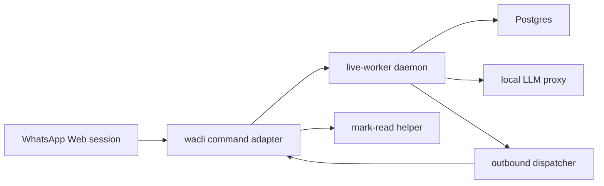

# Live WhatsApp Adapter

This branch adds the held-back live WhatsApp runtime pieces:

- `apps/wa-adapter-wacli` wraps `wacli` behind typed parser and client boundaries.
- `apps/worker` can run a live polling cycle, generate drafts, queue outbound work, dispatch approved text/file jobs, and mark handled messages as read through adapter-owned tooling.
- `tools/wacli-mark-read` provides the adapter-owned helper used for live read receipts.
- `scripts/live-worker-daemon.mjs` is the Compose-owned long-running worker entrypoint.

## Runtime Shape



## Commands

Authenticate the adapter:

```bash
corepack pnpm wa:auth:login
corepack pnpm wa:auth:status
```

Run one guarded intake pass:

```bash
corepack pnpm wa:ingest:once
```

Start the live stack:

```bash
corepack pnpm stack:live:up
```

`stack:live:up` stops stale Compose services, runs `wa:store:preflight`, and only then starts the live stack. The preflight checks `session.db`, backs up malformed disposable `wacli.db` cache files, warms missing or empty cache state with a bounded sync, and can optionally require configured chat queries before startup.

Stop everything:

```bash
corepack pnpm stack:down
```

## Guardrails

- Keep `.env`, `wacli` auth stores, media caches, live logs, and Postgres data outside git.
- Keep `VIJI_WACLI_LIVE_SEND_ENABLED=false` until the account is authenticated and live smoke checks pass.
- File sends remain recipient-confirmed; dashboard/API owner confirmation must not release a file.
- Polling and reconnect behavior should degrade to idle/no-reply if the data root, sentinel, network, or adapter session is unavailable.
- Treat `session.db` as durable auth state and `wacli.db` as rebuildable cache. Preflight must never delete or overwrite a malformed session file automatically.
