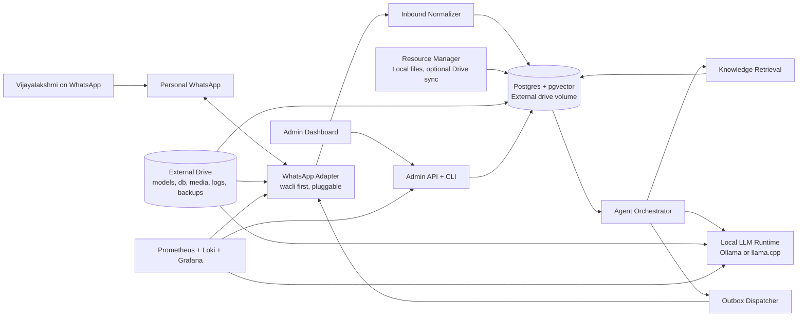
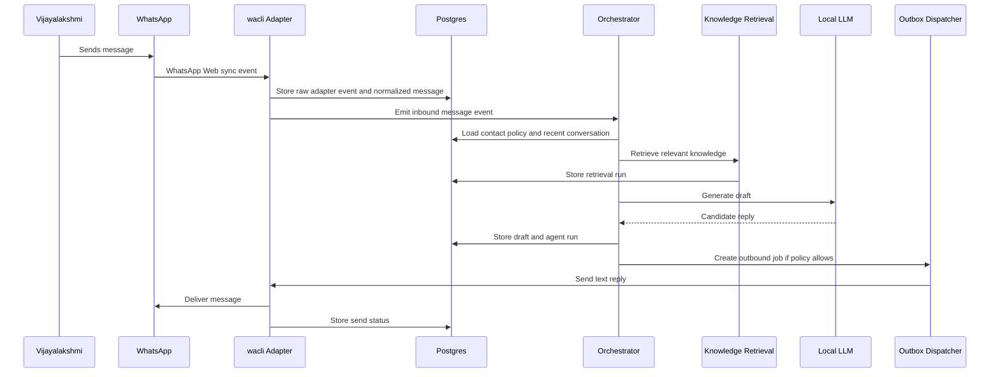

# Technical Design Document

## 1. Purpose

Design **Pratiksha**, a free and open-source, Dockerized, local-first AI assistant that replies on your behalf to messages from Vijayalakshmi Saravanan on personal WhatsApp. The first release should only handle text replies. Later releases should add a dedicated knowledge base, file/resource sharing, Drive-style sync options, monitoring, logs, and operational controls.

This is a technical design document, not implementation. It also includes the testing strategy so the eventual build can be developed test-first.

## 2. Hard Constraints

- You are not using WhatsApp Business.
- Heavy storage must live on an external drive, not the Mac internal disk.
- External-drive usage must stay inside a 200 GB maximum allocation, with `large-200gb` as the default profile and `small-100gb` as optional compact mode.
- The project should be free and open-source where possible.
- Docker must be the primary runtime.
- The production runtime must not depend on you keeping a laptop lid open for control. If the host sleeps or the SSD disconnects, the assistant must enter idle/no-reply behavior until it recovers.
- The assistant must only reply to explicitly allowed contacts: Vijayalakshmi Saravanan as primary, and `Myself` retained as a controlled development/test contact.
- Fallback behavior should prefer an idle state over partial or risky operation.
- Monitoring must work both visually and through CLI commands.
- Initial setup/onboarding must work visually in the dashboard, not only through CLI commands.
- The system should support future knowledge base, file sharing, and resource sharing without rewriting the core message pipeline.

## 3. WhatsApp Reality Check

There are two broad paths:

- Personal WhatsApp automation through WhatsApp Web-compatible tools such as `wacli`, direct `whatsmeow`, Baileys, whatsapp-web.js, or Evolution API.
- Official WhatsApp Business Platform Cloud API.

Because you are not using WhatsApp Business, Phase 1 should use the personal WhatsApp path. This is the only path that matches your current account setup. It has an important tradeoff: these tools are third-party and are not officially endorsed by WhatsApp. The design contains a hard adapter boundary and a kill switch so the WhatsApp-specific risk does not leak into the AI, knowledge base, or monitoring layers.

Official Meta documentation says the WhatsApp Business Platform is a programming interface for businesses, requires business assets such as a WABA and business phone number, and warns against non-authorized third-party tools. It also confirms the official On-Premises API expired on October 23, 2025, so there is no current official self-hosted WhatsApp server path. See "Sources" at the end.

## 4. Goals

### Phase 1: Text Assistant

- Detect inbound messages from Vijayalakshmi and the explicit `Myself` test contact while keeping Vijayalakshmi as the production primary.
- Generate a local AI text response.
- Send safe text responses through the selected personal WhatsApp adapter without laptop confirmation when trusted-contact auto mode is enabled and all policy gates pass.
- Save conversations, generated drafts, sent replies, failures, and audit history.
- Recover allowlisted chat context across connect/reconnect by replaying missed messages, backfilling older history, and summarizing conversation state.
- Provide pause, resume, read-only mode, and recipient-confirmation flows.
- Provide logs and dashboards.

### Phase 2: Knowledge Base

- Ingest local documents from the external drive.
- Chunk, embed, and index documents locally.
- Retrieve relevant snippets before generating replies.
- Show source references in the admin UI for review.
- Support reindexing and document versioning.

### Phase 3: Files and Resources

- Register local files as shareable resources.
- Recommend files/resources during response generation.
- Require an exact-file confirmation turn in WhatsApp before sending files so unattended operation never waits on you.
- Promote eligible media previously received from Vijayalakshmi into the resource catalog so she can ask for it again later.
- Support optional Drive-like sync connectors later.

### Phase 4: Hardening

- Add richer queueing, backups, restore checks, alerting, and chaos tests.
- Add contact-specific behavior profiles and long-term memory controls.
- Add optional official WhatsApp Business Cloud API adapter if you later move to a business number.

## 5. Non-Goals

- No bulk messaging.
- No marketing automation.
- No replies to unknown contacts by default.
- No scraping or automation outside the selected WhatsApp adapter.
- No cloud LLM requirement.
- No dependence on paid SaaS for the core path.
- No guarantee that unofficial WhatsApp automation is risk-free.

## 6. Recommended Architecture



## 7. Component Design

### WhatsApp Adapter

Responsibilities:

- Authenticate as a linked WhatsApp Web device.
- Sync incoming messages.
- Normalize inbound WhatsApp data into internal events.
- Send text replies and later media/files.
- Expose health, auth, connection, and backoff state.
- Never decide what to say. It only transports messages.

Preferred Phase 0 candidate: `wacli`.

Why:

- Built on `whatsmeow`.
- Local sync and search.
- Scriptable JSON output.
- Sends text, quoted replies, and files.
- Supports diagnostics, read-only mode, store locking, reconnect bounds, and bounded media queue backpressure.
- Does not require a Chromium/Puppeteer container.

Risk:

- It is a CLI, not a stable application server API.
- The local store schema may change.
- Live event extraction may require polling or wrapping `sync --follow`.
- It still uses the WhatsApp Web protocol, so account risk remains.

Adapter alternatives:

| Option | Best Use | Pros | Cons | Phase |
| --- | --- | --- | --- | --- |
| `wacli` | One-contact local assistant | CLI-first, local store, files, search, good diagnostics | Not a server API, may need polling | Phase 0 default candidate |
| direct `whatsmeow` | Custom high-performance adapter | Go library, direct events, lower overhead | More code to own | Phase 1 fallback if `wacli` is limiting |
| Baileys | Node event-driven adapter | Mature event surface, media support | JS dependency surface, unofficial protocol churn | Consider if Go path fails |
| whatsapp-web.js | Browser-compatible automation | Large community, easy examples | Heavier Chromium/Puppeteer runtime | Last resort for personal path |
| Evolution API | Self-hosted WhatsApp gateway | Batteries included, webhook-like API | Bigger stack than needed for one contact | Consider for multi-user future |
| Official Cloud API | Business/compliance path | Official webhook and send API | Requires WhatsApp Business Platform setup | Future only |

Phase 0 adapter evaluation criteria:

- Auth persistence: QR/pairing should survive container restart when the store is on the external drive.
- Inbound latency: new messages from allowlisted contacts should be detected within 5 seconds during normal operation.
- Send latency: text reply command should complete within 5 seconds during normal operation.
- Reconnect behavior: temporary network loss should enter backoff and recover without duplicate sends.
- History recovery: reconnect should replay missed allowlisted messages from a durable cursor before generating new replies.
- Store control: all auth/session/media data must be redirected to the external drive.
- Machine readability: command/event output must be parseable without fragile terminal scraping.
- File support: adapter must support sending a local file path for Phase 3.
- Diagnostics: adapter must expose a reliable health/auth check.
- Resource profile: adapter should stay lightweight enough for long-running Docker use.
- Failure clarity: adapter failures must be classifiable as auth, network, rate/backoff, send failure, or unknown.

Decision rule:

- Use `wacli` if it passes auth persistence, inbound detection, send, store control, and diagnostics tests.
- Move to direct `whatsmeow` if `wacli` is reliable manually but awkward or fragile to wrap as a daemon.
- Move to Baileys only if the Go path fails and the Node event API materially reduces complexity.
- Use whatsapp-web.js only if browser-level compatibility becomes more important than storage and CPU footprint.
- Use Evolution API only if the project grows beyond one-contact automation and needs a prebuilt gateway.

### Inbound Normalizer

- Converts adapter-specific events into internal `messages`.
- Applies idempotency by external message ID.
- Rejects messages not belonging to allowlisted contacts.
- Deduplicates reconnect/backfill events before creating drafts.
- Persists raw payloads for debugging with PII redaction controls.
- Emits `message.received`, `message.ignored`, or `adapter.auth_required` events.

### Agent Orchestrator

- Loads contact profile and policy.
- Builds context from recent messages and knowledge base retrieval.
- Refuses auto-send when conversation context is stale after reconnect; internal blocked drafts/proposals may still be recorded for audit.
- Calls local LLM runtime.
- Scores answer confidence.
- Creates a draft.
- Decides whether to auto-send, ask for recipient confirmation, ask for clarification, or idle.
- Creates an outbox job only after policy checks pass.

### Local AI Runtime

Runtime candidates:

- Ollama host service on Apple Silicon for Metal acceleration while keeping model files on the SSD.
- Ollama container for ease of local model management.
- llama.cpp server for leaner runtime and stricter model path control.

Model storage:

- Store all model files under the external drive, for example `/Volumes/Arya 1TB/VijiAI/models`.
- Current Ollama model path is `/Volumes/Arya 1TB/VijiAI/models/ollama`.
- The Docker image should not bake in large model files.
- Startup must fail into `IDLE_MODEL_MISSING` if the configured model is absent.

### Knowledge Base

Storage:

- Postgres for metadata.
- `pgvector` for embeddings.
- File assets on the external drive.

Ingestion pipeline:

1. Detect files under configured local folders.
2. Compute hash and version.
3. Extract text.
4. Chunk text.
5. Create embeddings locally.
6. Store document/chunk metadata and vectors.
7. Mark source `indexed`.

Retrieval:

- Query vector index with the latest user message and conversation summary.
- Apply contact-specific permissions before returning chunks.
- Inject only the top relevant chunks into the prompt.
- Store retrieval run details for audit.

### Resource Manager

- Registers local files as shareable resources.
- Stores metadata, sensitivity, tags, contact allowlist, and recipient-confirmation requirements.
- Supports later connectors for Google Drive or other providers.
- Sends files only through the outbox dispatcher.
- Defaults to recipient confirmation for normal file sharing.
- Blocks files that are not allowed for the requester; asks clarification for low-confidence matches.

### Admin Dashboard

Minimum views:

- Onboarding checklist.
- System status.
- WhatsApp adapter state.
- Conversation timeline.
- Pending recipient confirmations.
- Recent sent replies.
- Knowledge base indexing status.
- Resource library.
- Error and idle state timeline.
- Logs and metrics links.

### CLI

Expected commands:

```bash
viji status
viji pause
viji resume
viji readonly on
viji readonly off
viji logs --service agent --tail 200
viji conversation --contact viji --last 20
viji kb reindex
viji storage status
viji storage profile
viji sync status
viji sync recover
viji chat backfill --contact <id>
viji media sync --contact <id>
viji context show --contact <id>
viji wa doctor
viji wa auth
viji backup run
viji restore check
```

## 8. Message Flow



## 9. Reply Policy

Policy is evaluated before every reply.

P0 policy:

- Contact must be allowlisted.
- Conversation must not be paused.
- Adapter must be authenticated.
- External drive must be mounted.
- Database must be writable.
- AI runtime must be healthy.
- Message must not be older than the configured response window.
- The same inbound message must not have already triggered a sent reply.

Modes:

- `auto`: generate and send automatically.
- `confirm_resource`: wait for Vijayalakshmi to confirm the exact proposed file before sending it.
- `readonly`: sync and log only, never send.
- `paused`: ignore inbound messages except audit logging.
- `idle`: system-driven state caused by missing dependency or degraded health.

Recommended default:

- Use readonly/dry-run behavior during development, live adapter testing, and prompt tuning.
- Product target is `auto` for Vijayalakshmi text replies once policy, context recovery, outbox idempotency, and live adapter hardening pass.
- Keep file/resource sharing in recipient-confirmation mode even after text is automatic.

## 10. Fallback and Idle States

| Condition | State | Behavior |
| --- | --- | --- |
| External drive missing | `IDLE_DISK_MISSING` | Stop adapter writes, stop AI generation, do not send replies |
| DB unavailable | `IDLE_DB_UNAVAILABLE` | Do not process inbound messages because idempotency cannot be guaranteed |
| WhatsApp session logged out | `IDLE_AUTH_REQUIRED` | Stop outbound, show QR/auth action in CLI/dashboard |
| Network unavailable | `IDLE_NETWORK_DOWN` | Keep local dashboard alive, no outbound attempts, exponential health checks |
| AI model missing | `IDLE_MODEL_MISSING` | Do not generate replies, show model path and expected file |
| AI runtime unhealthy | `IDLE_AI_UNAVAILABLE` | Do not send AI replies; optional manually configured static response stays disabled by default |
| Knowledge base unavailable | `DEGRADED_KB_UNAVAILABLE` | Phase 1 can continue text-only; Phase 2 blocks resource sharing or asks clarification |
| Resource store unavailable | `DEGRADED_RESOURCE_UNAVAILABLE` | Text replies allowed, file/resource sharing blocked |
| Conversation context stale | `DEGRADED_CONTEXT_STALE` | Recover missed messages and summaries; block auto-send until sync is current |
| External drive below warning threshold | `DEGRADED_STORAGE_LOW` | Continue text replies, block new indexing, media downloads, and nonessential backups |
| External drive full or unwritable | `IDLE_STORAGE_FULL` | Stop all processing that requires writes, including outbound sends |
| Adapter rate limited or reconnecting | `IDLE_ADAPTER_BACKOFF` | Queue no new outbound jobs, retry health checks |
| Contact not allowlisted | `IGNORED_CONTACT` | Store audit event only if policy allows, never reply |

The system must prefer silence over unsafe partial replies.

## 11. External Drive Layout

Recommended mount root:

```text
/Volumes/Arya 1TB/VijiAI/
  config/
    .env
    secrets/
  postgres/
  pgbackups/
  wacli/
    store/
    media/
  models/
  knowledge/
    inbox/
    processed/
    failed/
  viji-files/
    inbox/
    library/
    staged/
    thumbnails/
    manifests/
    tmp/
  logs/
    app/
    adapter/
    llm/
  grafana/
  prometheus/
  loki/
  tmp/
```

Local internal disk usage should be limited to:

- Source code.
- Docker image layers.
- Small boot scripts.
- Optional tiny state file containing the expected external drive identity.

The storage guard should verify:

- Path exists.
- Expected sentinel file exists.
- Filesystem is writable.
- Free space is above threshold.
- Optional drive UUID matches configuration.

### Storage Budget

The default deployment profile is 200 GB. A smaller 100 GB profile remains available for compact deployments.

| Area | 100 GB target | 200 GB target | Controls |
| --- | ---: | ---: | --- |
| Local LLM models | 15-30 GB | 30-60 GB | Keep 1 primary model, 1 fallback model, quantized formats only |
| Postgres and pgvector | 5-15 GB | 10-30 GB | Message retention, vector dimensions, vacuum, document chunk count |
| WhatsApp adapter cache | 2-8 GB | 5-15 GB | Adapter auth/session/cache only; Postgres remains canonical for app messages |
| WhatsApp/media cache | 0-10 GB | 0-25 GB | Allowlisted chat media downloads only, quota-controlled |
| Knowledge source files | 10-25 GB | 25-50 GB | Prefer indexing selected folders; avoid duplicate copies where possible |
| Shareable resources | 5-15 GB | 10-30 GB | Manual resource registration and per-resource size limits |
| Logs and observability | 3-8 GB | 5-15 GB | Loki retention, JSON log rotation, metric retention |
| Backups | 10-20 GB | 20-40 GB | Keep limited compressed DB backups and restore checkpoints |
| Temporary workspace | 2-5 GB | 5-10 GB | Clean on startup and after failed jobs |
| Reserved free space | 15 GB minimum | 25 GB minimum | Required headroom for DB writes and safe shutdown |

Storage rules:

- The 200 GB profile is the baseline for this SSD.
- Do not bake model files into Docker images.
- Do not download non-allowlisted WhatsApp media; allowlisted chat media is quota-controlled.
- Do not keep unlimited raw adapter payloads.
- Do not keep unlimited vector versions after reindexing.
- Block new ingestion, media downloads, and backup jobs when the warning threshold is crossed.
- Enter `IDLE_STORAGE_FULL` when the database or adapter store cannot be written safely.
- Prefer one high-quality local model plus one smaller fallback model over many model variants.
- Surface quota usage in both dashboard and CLI.

### Chat Context Recovery

The assistant must maintain useful conversation context after startup, disconnect, reconnect, or adapter restart.

Approach:

1. Store normalized allowlisted messages in Postgres with external message idempotency, including `from_me` outbound messages.
2. Store adapter auth, local cache, and allowlisted media under `/Volumes/Arya 1TB/VijiAI/wacli`; do not treat adapter SQLite files as canonical application storage.
3. Track latest synced message, oldest backfilled message, reconnect checkpoint, and media checkpoint in operations tables.
4. On reconnect, run adapter health/auth checks, recover missed messages from the last durable cursor, then resume live polling/sync.
5. Backfill all available history for allowlisted contacts as a resumable background job.
6. Download allowlisted chat media with storage quota controls and resumable media jobs.
7. Link downloaded allowlisted media to `res_file_assets`; when useful, promote it to `res_resources` so previously received images/files can be proposed and re-sent through the same exact-confirmation workflow.
7. Maintain rolling conversation summaries for older history so prompt context remains compact.
8. Mark `DEGRADED_CONTEXT_STALE` if sync recovery fails or cannot prove the allowlisted chat is current.
9. Block auto-send when context is stale; internal blocked drafts/proposals may be recorded for audit.

## 12. Docker Compose Shape

Implemented services:

- `storage-guard`: validates external drive and emits health state.
- `postgres`: relational data plus vector index through pgvector.
- `api`: admin API, policy engine, dashboard data API, and current command endpoints.
- `dashboard`: web UI and API proxy.
- `llm-proxy`: lightweight proxy to the host Ollama runtime.
- `live-worker`: Compose-owned live WhatsApp poll, automation, confirmation, and dispatch daemon.
- `prometheus`: metrics.
- `loki`: logs.
- `promtail`: container log shipping.
- `grafana`: visual dashboard.

Planned services:

- `wa-adapter-wacli`: optional long-running adapter wrapper if the Docker-contained `wacli` command adapter is not enough.
- `backup`: scheduled local backup and restore verification.

Compose lifecycle:

- Normal operation must be controlled by Docker Compose, not local background Node processes.
- `corepack pnpm stack:dashboard:up` starts the dashboard profile, which includes `postgres`, `api`, and `dashboard`.
- `corepack pnpm stack:app:up` starts the app profile, which includes `postgres`, `api`, and `llm-proxy`.
- `corepack pnpm stack:live:up` starts the live worker with command-scoped live flags after the Phase 17 gate passes.
- `corepack pnpm stack:down` stops all Compose services for this project before SSD eject.
- The dashboard container must call the API through Docker service DNS at `http://api:8787`.
- `host.docker.internal` is only for container-to-host dependencies such as host Ollama, not for dashboard-to-API traffic.

The initial implementation should avoid Kubernetes, cloud queues, and paid observability tools.

## 13. Data and Security

Controls:

- Only allowlisted contacts can trigger the agent.
- Store WhatsApp auth/session data only on the external drive.
- Store shareable files only under `VIJI_RESOURCE_ROOT`, defaulting to `/Volumes/Arya 1TB/VijiAI/viji-files`.
- Keep secrets in `.env` or Docker secrets under the external drive.
- Redact phone numbers and message bodies from default logs where possible.
- Keep full message text in the database only if retention policy allows it.
- Add a global kill switch that blocks all sends.
- Keep recipient confirmation for files by default; block resources that are not allowed for Vijayalakshmi and ask clarification for low-confidence matches.
- Never share arbitrary local paths; files must be registered from the resource repository first.
- Previously received WhatsApp media must also be registered or promoted as a resource before it can be sent again.
- Use an encrypted external drive if the message history or resources are private.
- Avoid sending hidden system prompts, source document internals, or file paths.

Prompt-injection mitigation:

- Treat user messages and document content as untrusted.
- The system prompt must say retrieved content is reference material, not instructions.
- File/resource sharing must be policy-gated outside the LLM.
- The LLM can recommend a resource, but only the policy engine can authorize sharing.
- Normal one-match resource flow: user asks for a file, assistant asks "Do you mean `<registered filename>`?", user confirms "yes", then the outbox sends that exact pending file.
- Ambiguous resource flow: user asks for a broad file category, assistant lists registered filenames, and Vijayalakshmi confirms by list number or a unique descriptive phrase such as "12th marksheet".
- Received-media reuse flow: user asks for media she previously sent, assistant lists matching registered/promoted media using safe labels such as filename, caption, and received date, and sends only the exact confirmed item.
- A "yes" confirmation is valid only for a single-file pending proposal. For multi-file proposals, "yes" remains ambiguous and must not send.
- Confirmation is valid only for the most recent pending file proposal in that conversation and must expire after the configured confirmation window.

## 14. Monitoring and Logs

Metrics:

- `viji_adapter_connected`
- `viji_adapter_auth_required`
- `viji_external_drive_mounted`
- `viji_inbound_messages_total`
- `viji_ignored_messages_total`
- `viji_drafts_created_total`
- `viji_outbound_sent_total`
- `viji_outbound_failed_total`
- `viji_agent_latency_seconds`
- `viji_llm_latency_seconds`
- `viji_kb_retrieval_latency_seconds`
- `viji_idle_state`
- `viji_external_drive_free_bytes`
- `viji_storage_quota_used_bytes`
- `viji_storage_quota_limit_bytes`
- `viji_context_stale`
- `viji_sync_lag_seconds`
- `viji_backfill_remaining_messages`

Logs:

- JSON logs for app, worker, adapter wrapper, and ingestion.
- Correlation ID per inbound message.
- Audit events for send, recipient confirm/deny, pause, resume, auth, and config changes.
- Sensitive payload logging disabled by default.

Dashboards:

- System health.
- WhatsApp adapter health.
- Conversation throughput.
- AI latency and failures.
- Knowledge base indexing.
- Disk usage.
- Idle/degraded state timeline.

CLI:

- `viji status` should summarize the same state as the dashboard.
- `viji logs` should read from Loki if available and fall back to local log files.

## 15. Testing Strategy

### Unit Tests

- Contact allowlist logic.
- Reply policy state machine.
- Message idempotency.
- Prompt construction.
- RAG chunk selection.
- Resource permission checks.
- Idle state transitions.

### Contract Tests

- Adapter emits normalized inbound message schema.
- Adapter send command accepts normalized outbound job schema.
- LLM client returns structured draft result.
- Embedding service returns expected vector dimensions.

### Integration Tests

- Postgres schema migration and rollback.
- pgvector insert and retrieval.
- wacli wrapper command parsing with recorded JSON fixtures.
- Reconnect recovery, missed message replay, history backfill, and media download checkpointing.
- Outbox retry behavior.
- Dashboard API health responses.

### End-to-End Tests

Use redacted `wacli` fixtures and isolated test doubles for unsafe-to-repeat paths:

1. Inject a redacted inbound message shape from an allowlisted contact, with Vijayalakshmi as the primary fixture and Myself as the development fixture.
2. Assert draft created.
3. Assert auto-send or recipient-confirmation behavior based on policy.
4. Assert outbound job idempotency.
5. Assert logs, metrics, and audit event created.

Runtime implementation must use live `wacli`, not a fake WhatsApp adapter. Live smoke tests run only after manual QR authentication and explicit operator opt-in:

1. `wacli doctor`.
2. Sync recent messages.
3. Identify Vijayalakshmi and Myself contact/JIDs.
4. Send a controlled test reply in manual mode.
5. Verify receipt state or adapter success state.

### Failure Tests

- Unmount external drive while services are running.
- Fill external drive past the warning threshold.
- Fill external drive until writes fail.
- Stop Postgres.
- Stop LLM runtime.
- Disable network.
- Log out WhatsApp linked device.
- Corrupt one knowledge source file.
- Send duplicate inbound message event.

Acceptance rule: unsafe send must not happen in any failure test.

## 16. Documentation and Implementation Guardrails

Documentation gaps closed in this pass:

- Added an explicit developer guide so generated code has binding constraints.
- Added table prefixes to the ERD so migrations, repositories, and schemas do not create ambiguous table names.
- Added storage quota entities and thresholds so the 100-200 GB external-drive cap can be enforced in code.
- Added project-structure rules that keep WhatsApp adapter code, policy code, AI code, and persistence code separate.

Implementation rule:

- Code generation must follow [DEV_GUIDE.md](DEV_GUIDE.md), [PROJECT_STRUCTURE.md](PROJECT_STRUCTURE.md), and [ERD.md](ERD.md).
- If a requested implementation conflicts with these documents, update the design docs first, then implement.
- Any new database table must use the ERD prefix policy.
- Any new service must fit the documented Docker, storage, and idle-state model.
- Any WhatsApp-specific implementation must stay inside the adapter boundary.

## 17. Development Roadmap

### Phase 0: Adapter Spike and Final Decisions

- Install/build `wacli` in a local container or host test.
- Validate auth flow, sync, search, send text, send file, JSON output, and store path override.
- Verify whether `sync --follow` can be wrapped cleanly or whether polling the local store is needed.
- Compare with direct `whatsmeow` if `wacli` cannot provide reliable live events.
- Freeze adapter interface.

### Phase 1: Text-Only MVP

- Docker Compose base.
- External drive guard.
- Postgres schema.
- Redacted `wacli` fixture tests and isolated WhatsApp test doubles for unsafe failure paths.
- wacli adapter.
- Local LLM client.
- Contact allowlist.
- Readonly/dry-run mode.
- Auto mode behind explicit config.
- CLI status/logs/pause/resume.
- Basic dashboard.

### Phase 2: Knowledge Base

- Local document ingestion.
- Chunking and embeddings.
- pgvector retrieval.
- Source display in dashboard.
- Reindex commands.
- Retrieval audit trail.

### Phase 3: File and Resource Sharing

- Local resource registry.
- File send through adapter.
- Recipient confirmation flow.
- Resource recommendation in drafts.
- Optional Drive connector.

### Phase 4: Operational Hardening

- Backup and restore verification.
- Grafana dashboards.
- Alerting.
- More fallbacks.
- Disaster recovery runbook.
- Optional official WhatsApp Business adapter.

## 18. Open Decisions

- Sentinel identity and final storage quota thresholds for `/Volumes/Arya 1TB/VijiAI`.
- Whether Phase 1 should use `wacli` polling, `wacli sync --follow`, or direct `whatsmeow`.
- Which local LLM runtime and model fit your Mac hardware.
- Whether message bodies should be retained forever, summarized, or periodically deleted.
- Whether auto-reply should be enabled immediately or only after a readonly/dry-run tuning period.
- Whether Google Drive sync is needed or whether local folders are sufficient for resources.

## 19. Sources

- Meta WhatsApp Business Platform overview: https://developers.facebook.com/docs/whatsapp/overview
- Meta WhatsApp Webhooks overview: https://developers.facebook.com/docs/whatsapp/webhooks
- Meta On-Premises API sunset: https://developers.facebook.com/docs/whatsapp/on-premises/sunset
- `wacli` repository: https://github.com/steipete/wacli
- `whatsmeow` repository: https://github.com/tulir/whatsmeow
- whatsapp-web.js repository: https://github.com/wwebjs/whatsapp-web.js
